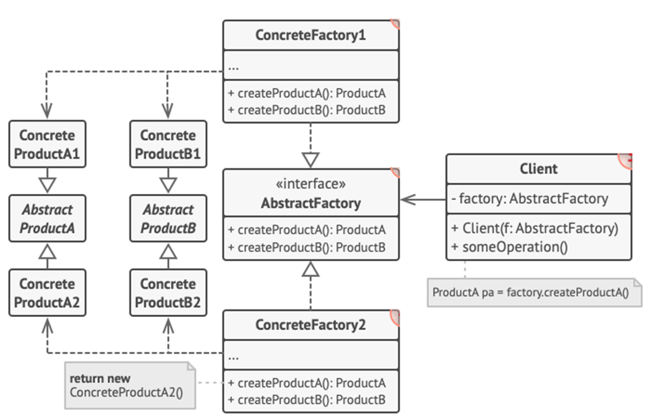

<h1>Abstract Factory Design Pattern</h1>
Abstract Factory Pattern defines an interface or abstract class for creating families of related/dependent objects without specifying their concrete sub-classes.

<h2>Example</h2>
With having a Factory Pattern you basically have your application to create an UFO.
Alien class make an UFO. Then we use a factory which based off the input from the Alien is going to shoot either an UFO, Rocket or Boss UFO.
The Factory then shoots out abstract classes that have name, speed and damage. Then these abstract classes are used to create a final product.
There are no concrete classes because all of that is abstracted out.

<h2>UML Diagram</h2>

<h2>When to use Factory Pattern</h2>
-	Allows for creating families of related objects without specifying a concrete class;
-	When many you have many objects that can be added or changed dynamically during runtime;
-	You can model anything and have those objects interact through common interfaces.

