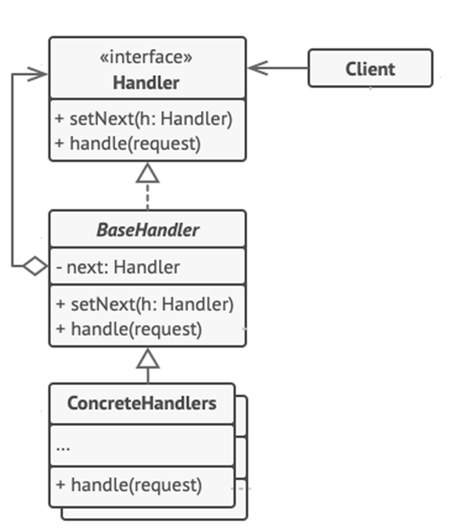

<h1>Chain of Responsibility Design Pattern</h1>

Chain of Responsibility is a behavioral design pattern that lets you **pass requests along of a chain of handlers**. Upon receiving a request, each handler decides either to process the request or to pass it to the next handler in the chain.

<h2>Example</h2>
 You’re working on an online ordering system. You want to restrict access to the system so only authenticated users can create orders. Also, users who have administrative permissions must have full access to all orders. 
 After a bit of planning, you realized that these checks must be performed sequentially. The application can attempt to authenticate a user to the system whenever it receives a request that contains the user’s credentials. However, if those credentials aren’t correct and authentication fails, there’s no reason to proceed with any other checks. 
 Later you decide to implement several more of those sequential checks. The problem is that as the implementations go by the code looks more and more bloated. Changing one check sometimes affected the others, code duplication occurs and the system became very hard to comprehend and expensive to maintain. 
 The Chain of Responsibility relies on transforming particular behaviors into stand-alone objects called handlers. 
 The pattern suggests that you link these handlers into a chain. Each linked handler has a field for storing a reference to the next handler in the chain. In addition to processing a request, handlers pass the request further along the chain. The request travels along the chain until all handlers have had a chance to process it. 

<h2>UML Diagram</h2>

<ol>
<li>

**Handler** declares the interface, common for all concrete handlers. It usually contains just a single method for handling requests, but sometimes it may also have another method for setting the next handler to the chain.
</li>
<li>

**Base Handler** is an optional class where you can put the boilerplate code that’s common to all handler classes.
</li>
<li>

**Concrete Handler** contain the actual code for processing requests.  Upon receiving a request, each handler must decide whether to process it and, additionally, whether to pass it along the chain.
</li>
<li>

**Client** may compose chains just once or compose them dynimacally, depending on the application’s logic.
</li>
</ol>

<h2>When to use Chain of Responsibility Pattern</h2>
<ul>
<li>
When your program is expected to process different kinds of requests in various ways, but the exact types of requests and their sequence are unknown beforehand;
</li>
<li>
When it’s essential to execute several handlers in a particular order;
</li>
<li>
When the set of handlers and their order are supposed to change at runtime.
</li>
</ul>