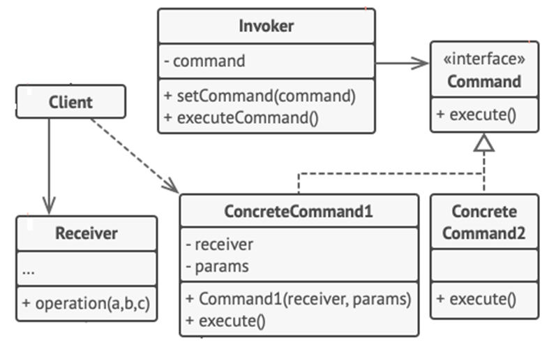

<h1>Command Design Pattern</h1>

Command is a behavioral design pattern that **turns a request into a stand-alone object** that contains all information about the request. This transformation lets you pass requests as a method arguments, delay or queue a request’s execution and support undoable operations.

<h2>Example</h2>
 In a restaurant, a waiter takes your order, writing it down on a piece of paper. Then the waiter goes to the kitchen and sticks the paper to the wall, which will then get to the chef. 
 After that the chef cooks the meal accordingly on a tray along with the order. The waiter checks the order to make sure everything is ok, and brings the order to the table. 
 The paper order serves as a command. It remains in a queue until the chef is ready to serve it. 

<h2>UML Diagram</h2>

<ol>
<li>

**Sender** class (aka invoker) is responsible for initiating requests. This class must have a field for storing a reference to a command object.
</li>
<li>

**Command** interface usually declares just a single method for executing the command.
</li>
<li>

**Concrete Command** implements various kinds of requests. A concrete command isn’t supposed to perform the work on its own, but rather to pass the call to one of the business logic objects.
</li>
<li>

**Receiver** class contains some business logic.
</li>
<li>

**Client** creates and configures concrete command objects.
</li>
</ol>

<h2>When to use Command Pattern</h2>
<ul>
<li>
When you need to parameterize objects according to an action perform;
</li>
<li>
When you need to create and execute request at different times;
</li>
<li>
When you need to undo procedures for past commands.
</li>
</ul>