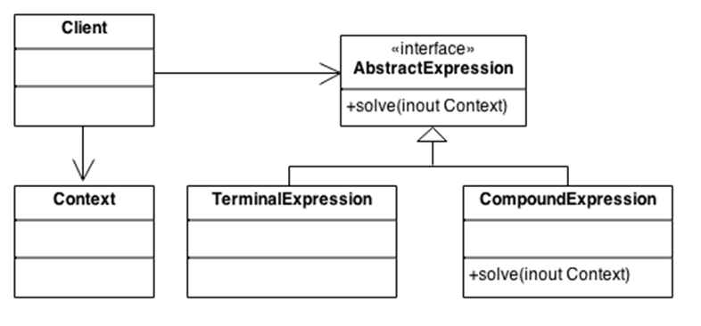

<h1>Interpreter Design Pattern</h1>
Interpreter design pattern is one of the behavioral design pattern. Interpreter pattern is used to defines a grammatical representation for a language and provides an interpreter to deal with this grammar.

<h2>Example</h2>
Musicians are examples of Interpreters. The pitch of a sound and its duration can be represented in musical notation on a staff. This notation provides the language of music. Musicians playing the music from the score are able to reproduce the original pitch and duration of each sound represented.

<h2>UML Diagram</h2>

<ol>
<li>

**Abstract Expression** declares an *interpret()* operation and nodes (terminals and nonterminal) in the AST overrides.
</li>
<li>

**Terminal Expression** implements the *interpret()* operation for terminal expressions.
</li>
<li>

**Compound Expression** implements the *interpret()* operation for all nonterminal expressions
</li>
<li>

**Context** contains information that is global to the interpreter. It is this String expression with the Postfix notation that has to be interpreted and parsed.
</li>
<li>

**Client** builds the AST assembled from the Terminal Expression and Compound Expression. The Client invokes the *interpret()* operation.
</li>
</ol>

<h2>When to use Interpreter Pattern</h2>
<ul>
<li>

When you want to represent a simple grammar as an abstract syntax tree like structure;
</li>
<li>
When you want to produce various types of output of your application’s data;
</li>
<li>
When you want to implement SQL parsers and symbol processing engines.
</li>
</ul>