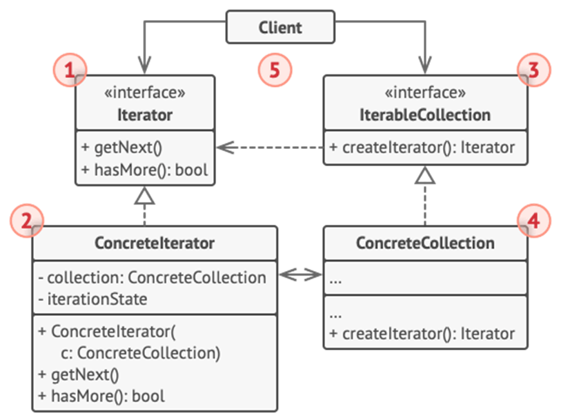

<h1>Iterator Design Pattern</h1>

Iterator is a behavioral design pattern that lets you **traverse elements of a collection without exposing its underlying representation**.

<h2>Example</h2>
 Collections are containers for group of objects and are one of the most used data types in programming. 
 Most collections store their elements in simple lists. However, some of them are based on stacks, trees, graphs and other complex data structure. 
 For accessing elements in a simple lists we just loop over all them but it gets complex when trying to sequentially traverse complex data structure like trees (we can have multiple traversal algorithms). 
 The main idea of the Iterator pattern is to **extract the traversal behavior of a collection into a separate object** called an *iterator*. 
 In addition to implementing the algorithm itself, an iterator object encapsulates all of the traversal details, such as the current position and how many elements are left till the end. Because of this, several iterators can go through the same collection at the same time, independently of each other. 

<h2>UML Diagram</h2>

<ol>
<li>

**Iterator Interface** declares the operations required for traversing a collection (fetching elements, retrieving current position, restarting iteration, etc.)
</li>
<li>

**Concrete Iterators** implement specific algorithm for traversing a collection.
</li>
<li>

**Collection Interface** declares one ore multiple methods foe getting compatible with the collection.
</li>
<li>

**Concrete Collections** return new instances of a particular concrete iterator class each tie the client requests one.
</li>
<li>

**Client** works with both collections and iterators via their interfaces.
</li>
</ol>

<h2>When to use Iterator Pattern</h2>
<ul>
<li>

When your collection has a complex data structure under the hood, but you want to **hide its complexity from clients**;
</li>
<li>

When you want to **reduce duplication of the traversal code** across your app;
</li>
<li>

When you want your code to be able to **traverse different data structures**;
</li>
<li>

When the **types of data structures** you want to travers **are unknown beforehand**.
</li>
</ul>