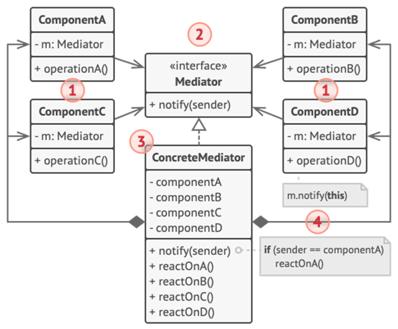

<h1>Mediator Design Pattern</h1>

Mediator is a behavioral design pattern that lets you reduce chaotic dependencies between objects. The pattern restricts **direct communications between the objects** and forces them to **collaborate only via** a **mediator object**.

<h2>Example</h2>

Say you have a dialog for creating and editing customer profiles. It consists of various form controls such as text fields, checkboxes, buttons, etc.
 Some of the form elements may interact with others (select button which reveals a hidden text field, button that has to validate values of all fields, etc.) 
 By having this logic implemented directly inside the code of the form elements you make these elements’ classes much harder to reuse in other forms of the app (you won’t be able use checkbox class inside another form, because it’s coupled to that text field. 
 The Mediator pattern suggests that you should cease all direct communication between the components which you want to make independent of each other. 
 As a result, the components depend only on a **single mediator class** instead of being coupled to dozens of their colleagues. 

<h2>UML Diagram</h2>

<ol>
<li>

**Components Classes** contain business logic. Each component has a reference to a mediator, declared with the type of the mediator interface. You can reuse the component in other programs by linking it to a different mediator.
</li>
<li>

**Mediator Interface** declares methods of communication with components, which usually include just a single notification method. 
</li>
<li>

**Concrete Methods** encapsulate relations between various components.
</li>
<li>

Components must not be aware of other components. If something important happens within or to a component, it must only notify the mediator.
</li>
</ol>

<h2>When to use Mediator Pattern</h2>
<ul>
<li>

When it’s hard to change some of the classes because they are tightly coupled to a bunch of  other classes;
</li>
<li>

When you can’t reuse component in a different program because it’s too dependent on other components;
</li>
<li>
 When you find yourself creating tons of component subclasses just to reuse some basic behavior in various contexts.
</li>
</ul>