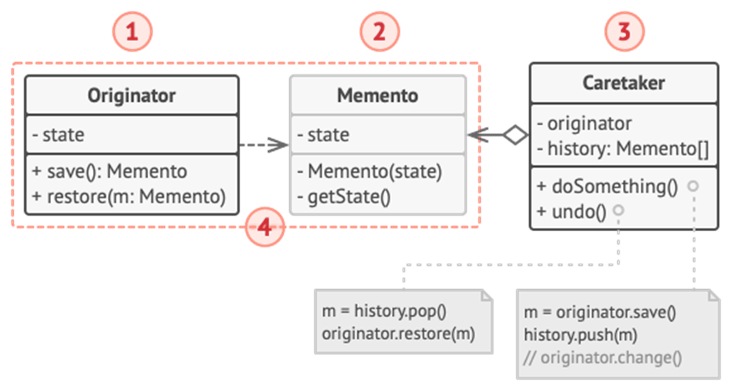

<h1>Memento Design Pattern</h1>

Memento is a behavioral design pattern that lets you **save and restore the previous state of an object without revealing the details of its implementation**.

 The Memento pattern delegates creating the state snapshots to the actual owner of that state, the *originator* object. Hence, instead of other objects trying to copy the editor’s state from the “outside,” the editor class itself can make the snapshot since it has full access to its own state. 
 The pattern suggests storing the copy of the object’s state in a special object called *memento*. The contents of the memento aren’t accessible to any other object except the one that produced it. Other objects must communicate with mementos using a limited interface which may allow fetching the snapshot’s metadata (creation time, the name of the performed operation, etc.), but not the original object’s state contained in the snapshot. 

<h2>UML Diagram</h2>

<ol>
<li>

**Originator Class** produces snapshots of its own states, as well as restore its state from snapshots when needed (sets and gets values from the currently targeted Memento). 
</li>
<li>

**Memento** is a value object that acts as a snapshot of the originator’s state.
</li>
<li>

**Caretaker** knows not only “when” and ‘”why” to capture the originator’s state, but also when the state should be restored. Typically holds and ArrayList that contains all previous versions of Memento.
</li>
<li>

The Memento class is nested inside the originator. This lets the originator access the fields and methods of the memento, even though they’re declared private. On the other hand, the caretaker has very limited access to the memento’s fields and methods, which lets it store mementos in a stack but not tamper with their state.
</li>
</ol>

<h2>When to use Memento Pattern</h2>
<ul>
<li>

When you want to produce **snapshots** of the object’s state to be able to restore a previous state of the object;
</li>
<li>

When direct access to the object’s fields/getters/setters **violates its encapsulation**.
</li>
</ul>