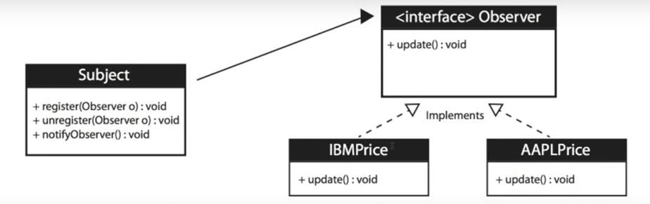

<h1>Observer Design Pattern</h1>
The Observer Pattern is a software design pattern that is used in “One-To-Many” relationship between objects, in which an object, called the subject, maintains a list of its dependents, called observers, and the subject notifies them automatically of any state changes, usually by calling one of their methods.
<h2>UML Diagram</h2>

<h2>When to use the Observer Pattern</h2>
<ul>
<li>When you need many other objects to receive an update when another object changes;</li>
<li>Stock market with thousands of stocks need to send updates to objects representing individual stocks;</li>
<li>The subject (publisher) sends many stocks to the Observers;</li>
<li>The Observers(subscribers) takes the ones they want and use them; </li>
<li>Loose coupling is a benefit- When the change of state in one object must be reflected in another object without keeping the objects tight coupled.</li>
</ul>