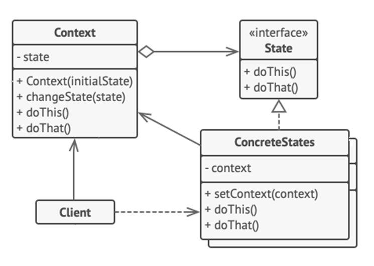

<h1>State Design Pattern</h1>

State is a behavioral design pattern that lets an object **alter its behavior when its internal state changes** (as if the object changed its class).
 The State pattern is closely related to the concept of a *Finite-State Machine*, which means that, at any given moment there’s a *finite* number of states which a program can be in. 

<h2>Example</h2>

We have a *Document* class.
A document can be in one of three states: *Draft*, *Moderation* and *Published*. The publish method of the document works a little bit differently in each state:
<ul>
<li>

In *Draft*, it moves the document to moderation.
</li>
<li>

In *Moderation*, it makes the document public, but only if the current user is an administrator.
</li>
<li>

In *Published*, it doesn’t do anything at all.
</li>
</ul>

*State machines* are usually implemented with lots of conditional statements (*if* or *switch*) that select the appropriate behavior depending on the current state of the object.
 That could difficult to maintain because any change to the transition logic may require changing state conditionals in every method. 
 The State pattern suggests that you create new classes for all possible states of an object and extract all state-specific behaviors into these classes. 

<h2>UML Diagram</h2>

<ol>
<li>

*Context* stores a reference to one of the concrete state objects and delegates to it all state-specific work. The context exposes a setter for passing it a new object. 
</li>
<li>
*State Interface* declares the state-specific methods. These methods should make sense for all concrete states because you don’t want some of your states to have useless methods that will never be called.
</li>
<li>

*Concrete States* provide their own implementations for the state-specific methods. Intermediate abstract classes that encapsulate some common behavior across states may be provided to avoid code duplication.
</li>
<li>

Both context and concrete states can set the next state of the context and perform the actual state transition by replacing the state objet linked to the context.
</li>
</ol>    

<h2>When to use State Pattern</h2>
<ul>
<li>

When you have an object that **behaves differently** depending on its current state, the **number** of states is **enormous**, and the state-specific **code changes frequently**;
</li>
<li>

When you have a class polluted with massive conditionals that alter how the class **behaves according** to the **current values** of the class’ fields;
</li>
<li>

When you have a lot of **duplicate code** across similar states and transitions of a condition-based state machine.
</li>
</ul>>