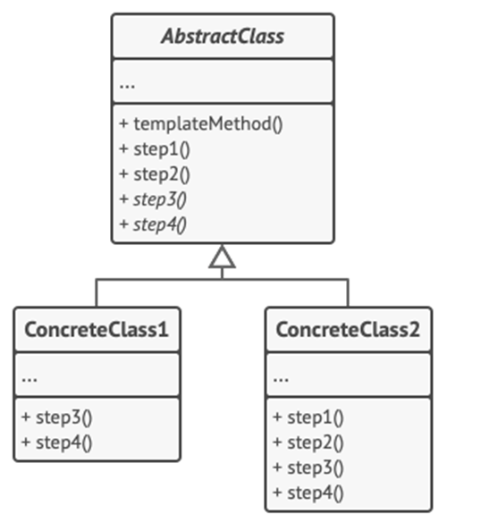

<h1>Template Design Pattern</h1>

Template is a behavioral design pattern that defines the **skeleton of an algorithm in the superclass** but lets **subclasses override specific steps of an algorithm without changing its structure**.

<h2>Example</h2>
You’re creating a data mining application that analyzes corporate documents (PDF, DOC, SCV) which users can then feed the app and extract data.
 The first version of the app could work only with DOC files. In the following version, it was able to support CSV files. A month later, you “taught” it to extract data from PDF files. 
 You noticed that all three classes have a lot of similar code. 
 While the code for dealing with various data formats was entirely different in all classes, the code for data processing and analysis is almost identical. 
 The Template Pattern suggests that you **break down an algorithm into a series of steps, turn these steps into methods, and put a series of calls to these methods inside a template method**. 
 The steps may either be abstract, or have some default implementation. To use the algorithm, the client is supposed to provide its own subclass, implement all abstract steps, and override some of the optional ones if needed. 

<h2>UML Diagram</h2>

<ol>
<li>

**Abstract Class** declares methods that act as steps of an algorithm, well as the actual template method which calls these methods in a specific order. The steps may either be declared abstract or have some default implementation.
</li>
<li>

**Concrete Class** can override all of these steps, but not the template method itself.
</li>
</ol>

<h2>When to use Template Method</h2>
<ul>
<li>
When you want to let clients extend only particular steps of an algorithm, but not the whole algorithm or it structure;
</li>
<li>
When you have several classes that contain almost identical algorithms with some differences.
</li>
</ul>