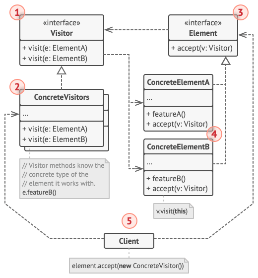

<h1>Visitor Design Pattern</h1>

Visitor is a behavioral design pattern that lets you **separate algorithms form the objects on which they operate**.
 Allows you to add methods to classes of different types without much altering to those classes. 
 You can make completely different methods depending on tha class used. 
 Allows you to define external classes that can extend other classes without majority editing them. 

<h2>Example</h2>

The Visitor pattern represents an operation to be performed on the elements of an object structure without changing the classes on which it operates. This pattern can be observed in the operation of a taxi company. When a person calls a taxi company (*accepting a visitor*), the company dispatches a cab to the customer. Upon entering the taxi the customer, or Visitor, is no longer in control of his or her own transportation, the taxi (*driver*) is.

<h2>UML Diagram</h2>

<ol>
<li>

**Visitor Interface** declares a set of visiting methods that can take concrete elements of an object structure as arguments.
</li>
<li>

Each **Concrete Visitor** *implements* several versions of the same behaviors, tailored for different concrete element classes.
</li>
<li>

**Element Interface** declares a method for "accepting" visitors. This method should have **one parameter** declared with the type of the visitor interface.
</li>
<li>

Each **Concrete Element** ***must*** implement the acceptance method. The purpose of this method is to **redirect the call to the proper visitor's method** corresponding to the current element class.
</li>
<li>

**Client** usually represents a collection or some complex objects.
</li>
</ol>

<h2>When to use Visitor Pattern</h2>
<ul>
<li>

When you need to **perform an operation on all elements** of a complex object structure (for example, object tree)
</li>
<li>

When you need to **clean up business logic** of auxiliary behaviors.
</li>
<li>

When a behavior **makes sense only in some classes of a class hierarchy**, but in others
</li>
</ul>