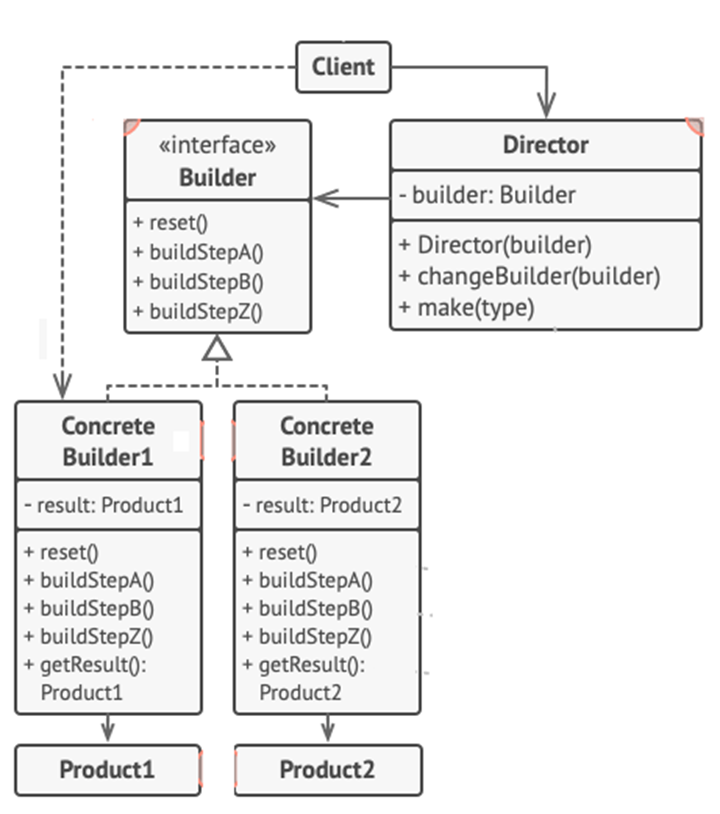

<h1>Builder Design Pattern</h1>

Builder is a creational design pattern that lets you ***construct*** complex ***objects step by step***. The pattern allow you to produce different types and representations of an object using the same construction mode.

<h2>Example</h2>
We have 3 builders. One that builds everything from wood and glass, the second one builds everything with stone and iron and the third that uses gold and diamonds.
 By calling the same set of steps you get a regular house from the first builder, a small castle from the second builder and a palace from the third. 
However, this would only work if the client code that calls the building steps is able to interact with builders using a common interface.

<h2>UML Diagram</h2>

<ol>
<li>

**Builder** interface declares product construction steps that are common to all types of builders.
</li>
<li>

**Concrete Builders** provide different implementations of the construction steps.
</li>
<li>

**Products** are resulting objects.
</li>
<li>

**Director** class defines the order in which to call construction steps, so you can create and reuse specific configurations of products.
</li>
<li>

**Client** must associate one of the bulder objects with the director.
</li>
</ol>
<h2>When to use Builder Pattern</h2>
<ul>
<li>When you want to build an object from a bunch of other objects;</li>
<li>When you want the creation of these parts to be independent of the main object;</li>
<li>When you want to hide the creation of the parts from the client so both aren’t dependent;</li>
<li>When the builder knows the specifics and nobody else does.</li>
</ul>