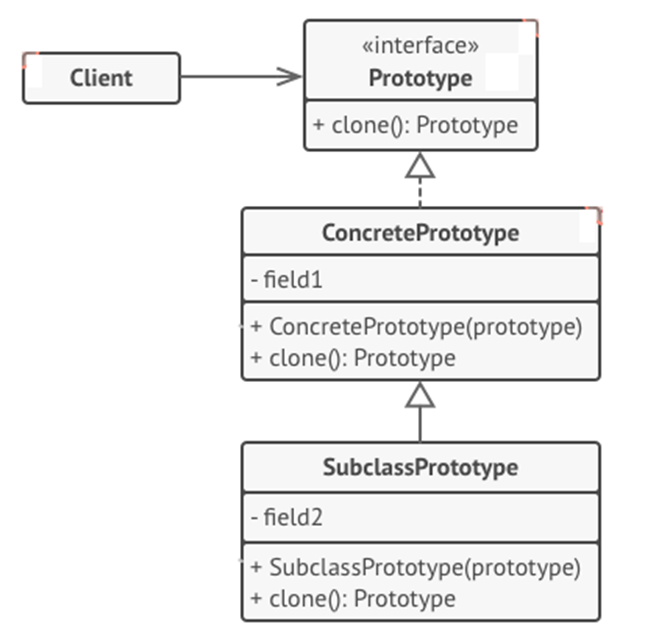

<h1>Prototype Design Pattern</h1>

Prototype is a creational design pattern **creates new objects (instances) by cloning (copying) other objects**.
<h2>Example</h2>
Splitting a cell, where two identical cells are created.

UML Diagram

<ol>
<li>

**Prototype** interface declares the cloning methods- **clone()**
</li>
<li>

**Concrete Prototype** implements the cloning method to copy the original object’s data to the clone.
</li>
<li>

**Client** can produce a copy of any object that follows the prototype interface.
</li>
</ol>
<h2>When to use Prototype Pattern</h2>
<ul>
<li>

When the classes are **instantiated at runtime**;
</li>
<li>

When the **cost of creating object is expensive or complicated**;
</li>
<li>

When you want the **number of classes** in an app **to be minimum**;
</li>
<li>

When the **client** application **needs to be unaware** of object creation and representation.
</li>
</ul>