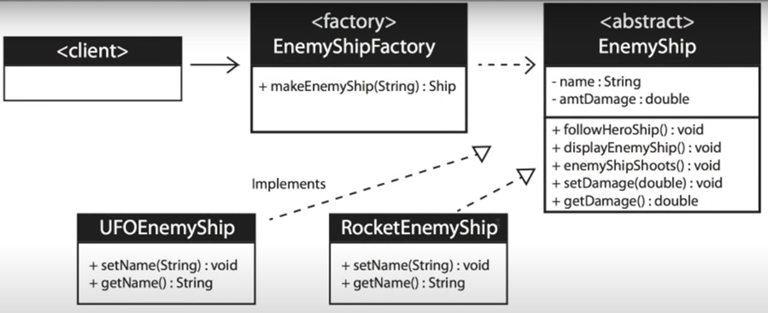

<h1>Factory Design Pattern</h1>

Factory Pattern is a creational design pattern that ***provides an interface for creating objects in a superclass***, but ***allows subclasses to alter the type*** of that will be created.
<h2>Example</h2>
-	When a method returns of several possible classes that share a common super class;
-	Create new enemy in a game;
-	Random number generator picks a number assigned to a specific enemy;
-	The factory returns the enemy associated with that number;
-	The class is chosen at runtime.
     <h2>UML Diagram</h2>

<h2>When to use the Factory Pattern</h2>
-	When you don’t know ahead of time what class object you need;
-	When all of the potential classes are in the same subclass hierarchy;
-	To centralize class selection code;
-	When you don’t want the user to have to know every subclass;
-	To encapsulate object creation.