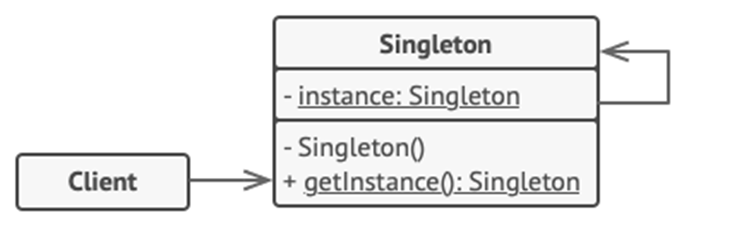

<h1>Singleton Design Pattern</h1>

Singleton is a creational design pattern that lets you ensure that a class has only **one instance**, while providing global access point to this instance.
To create the singleton class, we need to have **static member/variable** of class, **private constructor** and static **factory method**.

<h2>Types of Singleton Patterns</h2>
<ol>
<li>

**Early Instantiation** (Creation of instance at load time)
 In such case, we create the instance of the class at the time of declaring the static data member, so instance of the class is created at the time of classloading. 
</li>
<li>

**Lazy Instantiation** (Creation of instance when required)
 In such case, we create the instance of the class in synchronized method or synchronized block, so instance of the class is created when required. 

</li>
</ol>
<h2>Example</h2>
The office of the President is a Singleton. The Constitution specifies the means by which a president is elected, limits the term of office, and defines the order of succession. There can be at most one active president at any given time. Regardless of the personal identity of the active president, the title “The President of country X” is a global point of access that identifies the person in the office.

<h2>UML Diagram</h2>

 
The **Singleton** class declares the static method **getInstance()** that
returns the same instance of its own class.
 
 
The Singleton's constructor should be hidden from the client code.
Calling **getInstance()** method should be the only way of getting
the Singleton object.
 
<h2>When to use Singleton Pattern</h2>
<ul>
<li>	
When a class in your program should have just a single instance available to all clients ( single database object shared by different parts of the program)
</li>	
<li>When you need stricter control over global variables.</li>
</ul>