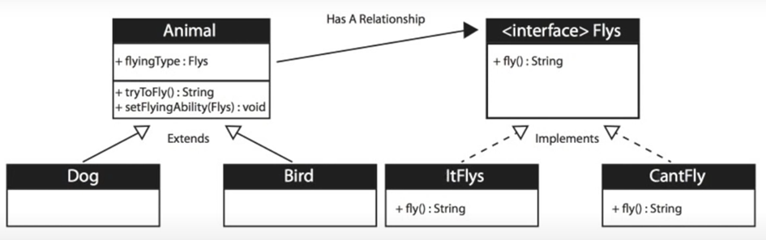

<h1>Strategy Design Pattern</h1>
Strategy design pattern defines a family of algorithms, encapsulates each one and makes them interchangeable and thus strategy lets the algorithm vary indepedently from the clients that use it.
<h2>Example</h2>
Let’s say we have an Animal class with a method fly(). For example Dog class extends the superclass and we can override the fly() method to do nothing.  The problem is if we have many subclasses that don’t use that method it will make maintenance difficult.

 The solution is to create an **Interface** Flyes and **use it** in the Animal class as an **instance variable** and we are going to dynamically change that instance variable to be either of type class ItFlyes or ItCantFly class. This will allow us to create many different types of flying without affecting the superclass or the subclasses. Classes that implement the Interface Flyes are going to allow those classes to use that code while eliminating code duplication. 

Basically instead of an Interface in a traditional way we use instance variable that is a subclass of the Flyes Interface. And the Animal doesn’t care what flying type does it just knows the behavior that is available to all of its subclasses (***composition***).

 It also allows to **change** the **capabilities** of objects **at runtime**. So if we create an object of type Animal and starts off as a non flying objects we can change it’s behavior to fly dynamically.  

<h3>UML Diagram</h3>

We are encapsulating the concept or the behavior that varies (***decoupling***).
<h2>When to use Strategy Design Pattern</h2>
<ul>
<li>When you want to define a class that will have one behavior that is similar to other behaviors in a list; </li>
<li>I want the class object to be able to choose from </li>
<ol>
<li>Not Flying;</li>	
<li>Fly with Wings;</li>
<li>Flying super Fast;</li>
<li> …</li>
</ol>
<li>When you need to use of several behaviors dynamically</li>
<li>Often reduces long lists of conditionals</li>
<li>Avoids duplicate code; </li>
<li>Can hide complicated/secret code from the user; </li>
<li>Keeps class changes from forcing other class changes. </li>
</ul>