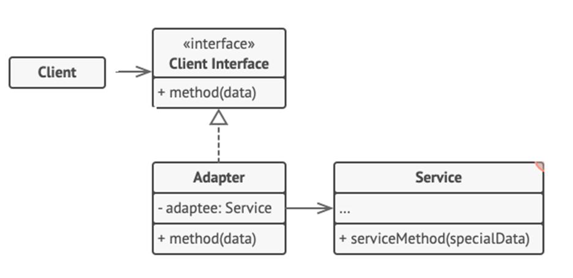

<h1>Adapter Design Pattern</h1>

Adapter is a structural design pattern that allows **object with incompatible interfaces to collaborate**.

<h2>Example</h2>
You are creating a stock market monitoring app. The app downloads the stock data from multiple sources in XML format and then displays charts and diagrams to the user.
 At some point, you decide to improve the app by integrating a smart 3rd-party analytics library. Unfortunately the analytics library only works with data in JSON format. 
 You can create an **adapter** object, which **converts the interface of one object so that another object can understand it**. 
 An adapter wraps one of the objects to hide the complexity of conversion happening behind the scenes. 

<h2>UML Diagram</h2>

<ol>
<li>

**Client** is a class that contains the existing business logic of the program.
</li>
<li>

**Client Interface** describes a protocol that other classes must follow to be able to collaborate with the client code. 
</li>
<li>

**Service** is some useful class (usually 3rd-party or legacy). 
</li>
<li>

**Adapter** is class that’s able to work with both the client and the service: it implements the client interface, while wrapping the service object 
</li>
<li>

The client code doesn’t get coupled to the concrete adapter class as long as it works with the adapter via the client interface.
</li>
</ol>

<h2>When to use Adapter Pattern</h2>
<ul>
<li>
When an object needs to utilize an existing class with an incompatible interface;
</li>
</ul>
