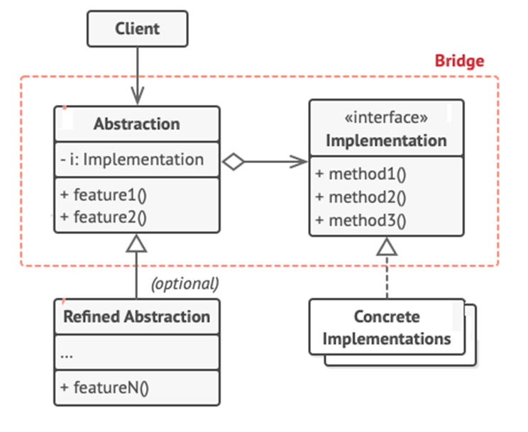

<h1>Bridge Design Pattern</h1>

Bridge is a structural design pattern that lets you **split a large class** or a set of closely related classes **into two separate hierarchies- abstraction and implementation**- which can be developed independently of each other.

<h2>Example</h2>

We have a geometric *Shape* class with a pair of subclasses: *Circle* and *Square*. We want to extend this class hierarchy to incorporate colors, so we plan to create *Red* and *Blue* shape subclasses.
 However, since we already have two subclasses, we’ll need to create four class combinations such for different colors for *Circle* and *Square* classes. 
Adding a new shape types and colors to the hierarchy will grow it exponentially- the further we go, the worse it becomes. 
 The *Bridge pattern* attempts to solve this problem by **switching from inheritance to the object composition**. 
 This means that we extract one of the dimensions into a separate class hierarchy, so that the original classes will reference an object of the new hierarchy, instead of having all of its state and behaviors within one class. 

<h2>UML Diagram</h2>

<ol>
<li>

**Abstraction** provides high-level control logic. It relies on the implementation object to do the actual low-level work. 
</li>
<li>

**Implementation** declares the interface that’s common for all concrete implementations. 
</li>
<li>

**Concrete Implementations** contain platform-specific code.
</li>
<li>

**Refined Abstractions** provide variants of control logic.
</li>
<li>

**Client** is responsible to link the abstraction object with one of the implementation objects.
</li>
</ol>
<h2>When to use Bridge Pattern</h2>
<ul>
<li>
When you want to divide and organize a class that has several variants of some functionality (for example, if the class can work with various database servers);
</li>
<li>
When you want to be able to change both the abstractions (abstract classes) and concrete classes independently;
</li>
<li>

When you want the **first abstract class** to **define rules** and the **concrete class** adds **additional rules**;
</li>
</ul>