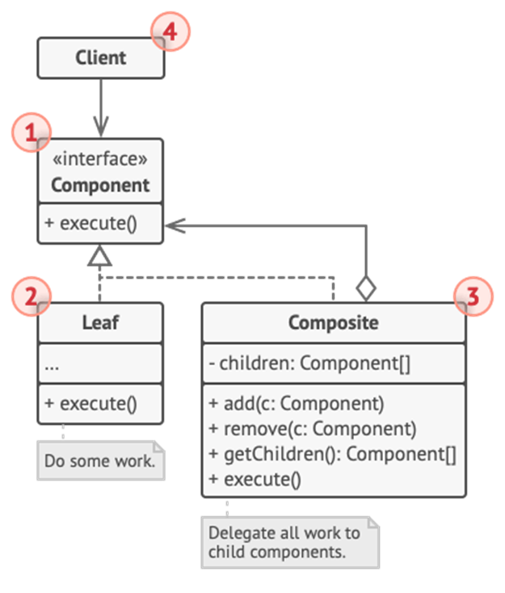

<h1>Composite Design Pattern</h1>

Composite is a structural design pattern that lets you **compose objects into tree structures** and then work with these structures as if they were **individual objects**.

<h2>Example</h2>
 You have two types of objects: *Products* and *Boxes*. A *Box* can contain several *Products* as well as a number of smaller *Boxes*. These little *Boxes* can also hold some *Products* or even smaller *Boxes*, and so on. 
 You decide to create an ordering system that uses these classes. Orders could contain simple products without any wrapping, as well as boxes stuffed with products and other boxes. 
 For determining the total price in a program wouldn’t be simple as running a loop. You have to know the classes of *Products* and *Boxes* and nesting level and details beforehand. 
 The Composite Pattern suggests that you work with *Products* and *Boxes* through a **common interface which declares a method for calculating the total price**. 

<h2>UML Diagram</h2>

<ol>
<li>

**Component Interface** describes that are common to both simple and complex elements of the tree. 
</li>
<li>

**Leaf** is basic element of a tree that doesn’t have sub-elements. Usually the do most of the work, since they don’t have anyone to delegate the work to.
</li>
<li>

**Container** (aka *composite*) is an element that has sub-elements: leaves or other containers and works with them via component interface.
</li>
<li>

**Client** works with all elements through the component interface. The client can work the both simple and complex elements of the tree.
</li>
</ol>

<h2>When to use Composite Pattern</h2>
<ul>
<li>

When you have to **implement a tree-like object structure**;
</li>
<li>

When you want the client code to treat both **simple and complex elements uniformly**.
</li>
</ul>
