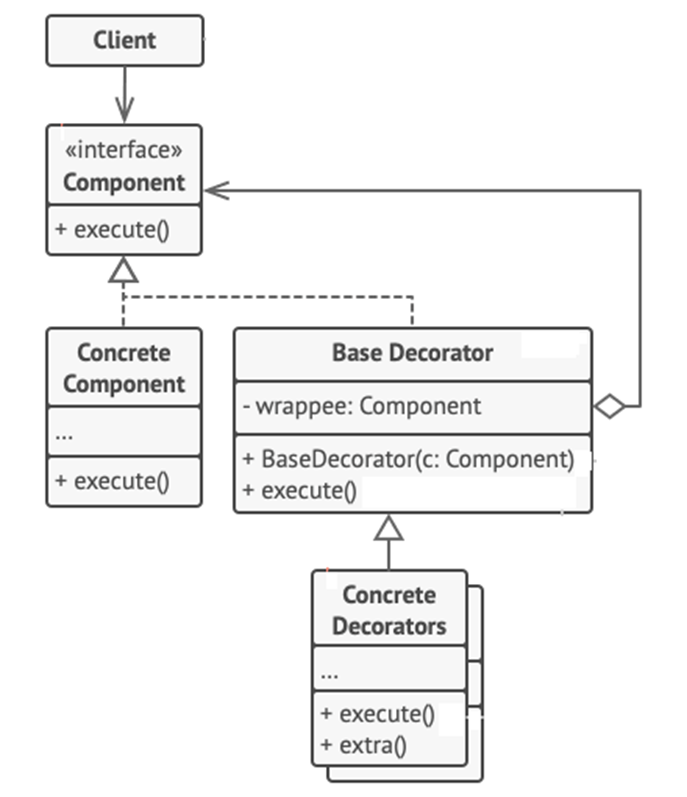

<h1>Decorator Design Pattern</h1>

Decorator is a structural design pattern that lets you attach new behaviors to objects by placing these objects inside special **wrapper objects** that contain the behaviors.
 It allows **modifying** object **dynamically**. 
 It is more flexible than inheritance. 
 It simplifies code because you add functionality using many simple classes. 
 You can extend rather rewriting old code. 

<h2>Example</h2>
Buying a coffee from coffee shop. You can order a decaf coffee or espresso for simplicity. But except the type of coffee you can add additions to the coffee (cream and/or honey and/or milk, etc.). All of these “extend” the behavior of the basic coffee.

<h2>UML Diagram</h2>

<ol>
<li>

**Component** declares the common interface for both wrapper and wrapper objects.
</li>
<li>

**Concrete** Component is a class of objects being wrapped. It defines the basic behavior, which can be altered by decorators.
</li>
<li>

**Base Decorator** class has a field for referencing a wrapped object.  The field’s type should be declared as the component interface so it can contain both concrete components and decorators.
</li>
<li>

**Concrete Decorators** define extra behaviors that can be added to components dynamically.
</li>
<li>

**Client** can wrap components in multiple layers of decorators, as long as it works with all objects via the compoment interface.
</li>
</ol>

<h2>When to use Decorator Pattern</h2>
<ul>
<li>
When you need to be able to assign extra behaviors at runtime without breaking the code that uses these objects;
</li>
<li>
When it’s not possible or not applicable to extend an objects’s behavior using inheritance
</li>
</ul>