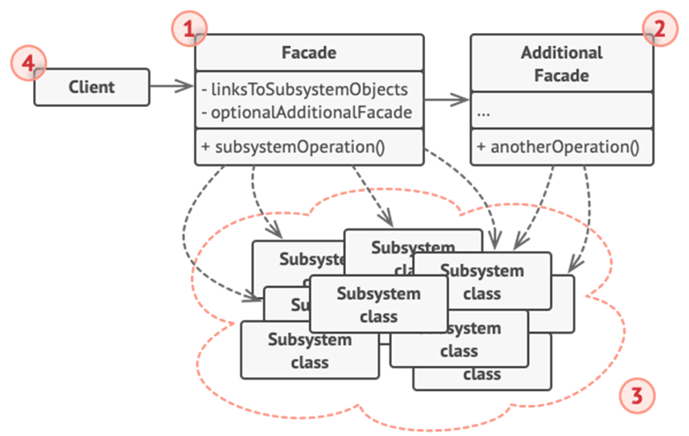

<h1>Facade Design Pattern</h1>

Facade is a structural design pattern which describes a **simplified interface that performs many other actions behind the scenes**.

<h2>Example</h2>

You are going the bank and you want to withdrawal some money. You would then expect person working there to check if your checking account number is correct, check if your security code is correct, check if those funds are available and then make changes accordingly, meaning they give the X amount of money and then subtract the X money from your current account.
 All of that process you would expect to happen quite seamlessly and that is how you would implement that using the Facade Design Pattern. 

<h2>UML Diagram</h2>

<ol>
<li>

**Facade** provides convenient access to a particular part of the subsystem’s functionality. It knows where to direct the client’s request and how to operate all the moving parts. 
</li>
<li>

**Additional** Face class can be created to prevent polluting a single façade with unrelated features that might make it yet another complex structure.
</li>
<li>

**Complex Subsystem** consists of dozens of various objects. To make them all do something meaningful, you have to dive deep into the subsystem’s implementation details, such as initializing objects in the correct order and supplying them with data in the proper format.
</li>
<li>

**Client** uses the facade instead of calling the subsystem objects directly.
</li>
</ol>

<h2>When to use Facade Pattern</h2>
<ul>
<li>
When you want to provide simple interface to a complex sub-system;
</li>
<li>
When several dependencies exist between clients and the implementation classes of an abstraction.
</li>
</ul>