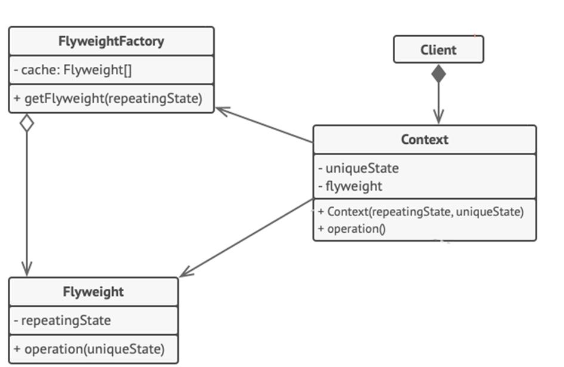

<h1>Flyweight Design Pattern</h1>

Flyweight is a structural design pattern that lets you fit more objects into the available amount of RAM by sharing common parts of state between multiple objects instead of keeping all of the data in each object.

<h2>Example</h2>

 Suppose we have a pen which can exist with/without refill. A refill can be of any color thus a pen can be used to create drawings having N number of colors. 
 Here Pen can be flyweight object with refill as extrinsic attribute. All other attributes such as pen body, pointer etc. can be intrinsic attributes which will be common to all pens. A pen will be distinguished by its refill color only, nothing else. 
 All application modules which need to access a red pen – can use the same instance of red pen (shared object). Only when a different color pen is needed, application module will ask for another pen from flyweight factory. 

<h2>UML Diagram</h2>

<ol>
<li>
Flyweight pattern is merely an optimization. Before applying it, make sure your program does have the RAM consumption problem related to having a massive number of similar objects in memory at the same time.
</li>
<li>

**Flyweight Class** contains the portion of the original object’s state that can be shared between multiple objects. The same flyweight object can be used in many different contexts. The state stored inside a flyweight is called *intrinsic*. The state passed to the flyweight’s method is called *extrinsic*. 
</li>
<li>

**Context Class** contains extrinsic state, unique across all original objects. When a context is paired with one of the flyweight objects, it represents the full state of the original object. 
</li>
<li>

Usually, the behavior of the original object remains in the flyweight class. In this case, whoever calls a flyweight’s method must also pass appropriate bits of the extrinsic state into the method’s parameters. On the other hand, the behavior can be moved to the context class, which would use the linked flyweight merely as a data object.
</li>
<li>

**Client** calculates or stores the extrinsic state of flyweights. From the client’s perspective, a flyweight is a template object which can be configured at runtime by passing some contextual data into parameters of its methods.
</li>
<li>

Flyweight Factory manages a pool of existing flyweights. With the factory, clients don’t create flyweights.  Instead, they call the factory, passing it bits of the intrinsic state of the desired flyweight. The factory looks over previously created flyweights and either returns an existing one that matches search criteria or creates a new one if nothing is found.
</li>
</ol>

<h2>When to use Flyweight Pattern</h2>
<ul>
<li>

When you program must support a huge number of objects which barely fit into available RAM;
</li>
</ul>
