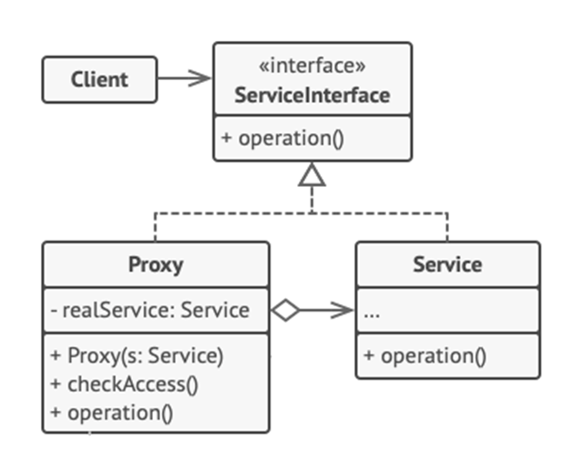

<h1>Proxy Design Pattern</h1>

Proxy is a structural design pattern that lets you provide a **substitute or placeholder for another object**. A proxy controls access to the original object, allowing you to perform something either before or after the request gets through the original object.

<h2>Example</h2>
You have a massive object that consumes a vast amount of system resources. You need it from time to time, but not always.
 You could implement lazy initialization: create this object only when it’s actually needed. All of the object’s clients would need to execute some deferred initialization code. Unfortunately, this would probably cause a lot of code duplication. 
 In an ideal world, we’d want to put this code directly into our object’s class, but that isn’t always possible. For instance, the class may be part of a closed 3rd-party library. 
 The *Proxy Pattern* suggests that you create a new proxy class with the same interface as an original service object. Then you update your app so that it passes the proxy object to all of the original object’s clients. 
Upon receiving a request from a client, the proxy creates a real service object and delegates the work to it.

<h2>UML Diagram</h2>

<ol>
<li>

**Service Interface** declares the interface of the Service. The proxy must follow this interface to be able to disguise itself as a service object. 
</li>
<li>

**Service Class** provides some useful business logic.
</li>
<li>

**Proxy Class** has a reference field that points to a service object. After the proxy finishes its processing, it passes the request to the service object.
</li>
<li>

**Client** should work with both services and proxies via the same interface. This way you can pass a proxy into any code that a expects a service object.
</li>
</ol>

<h2>When to use Proxy Pattern</h2>
<ul>
<li>

Lazy initialization (**virtual proxy**);
</li>
<li>

Access control (**protection proxy**);
</li>
<li>

Local execution of a remote service (**remote proxy**);
</li>
<li>

Logging requests (**logging proxy**)
</li>
<li>

Caching request results (**caching proxy**);
</li>
<li>

**Smart reference**. This is when you need to be able to dismiss a heavyweight object (free underlying system resources) once there are no clients that use it.
</li>
</ul>